# Step by Step Creation and Registration of Business Partner OData Service

## Introduction
As the SAP ERP 6.0 system doesn't has an API OData services by default, we have to create a custom service using the SAP Gateway Service Builder.

**Persona:** ABAP Developer

## Step-by-step Guide                
1. Navigate to [SAP API Hub - Business Partner (A2X) API ](https://api.sap.com/api/API_BUSINESS_PARTNER/overview) for  downloading EDMX file of Business Partner from API Business Hub. We will use this as a template for creating a custom OData service.

   * Click Download API Specifiation

     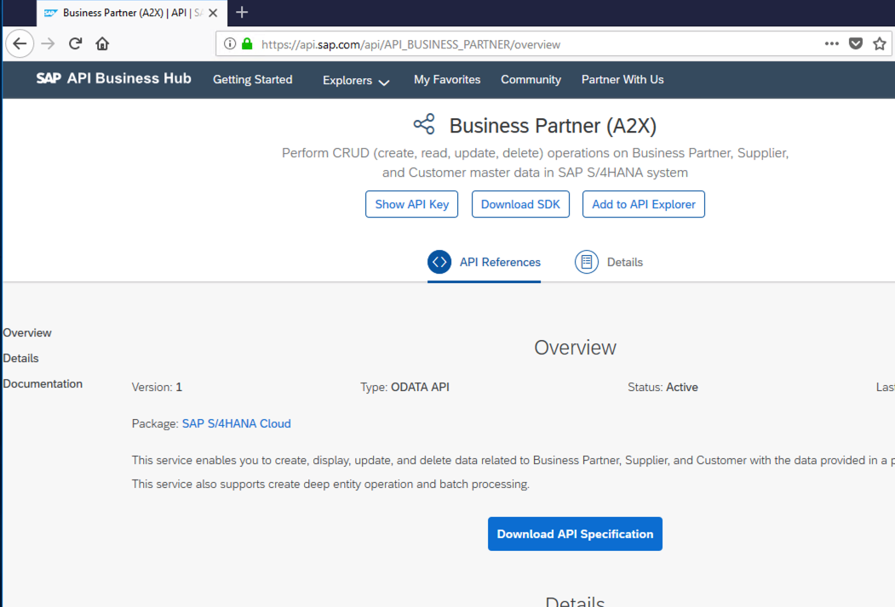

   * Logon to SAP API Hub using your SAP User

       

   * Select EDMX and save the file.

     

2. Logon to your ERP 6.0 system client 000 with the ABAP Dev user. Call transaction SEGW to create a new Project. Please set the following data:
   * **Project:** *ZAPI_BUSINESS_PARTNER*
   * **Description:** *Remote API for Business Partner*
   * **Package:** *$TMP*

   Keep the other settings. Then click on **Local Object** to create the project

   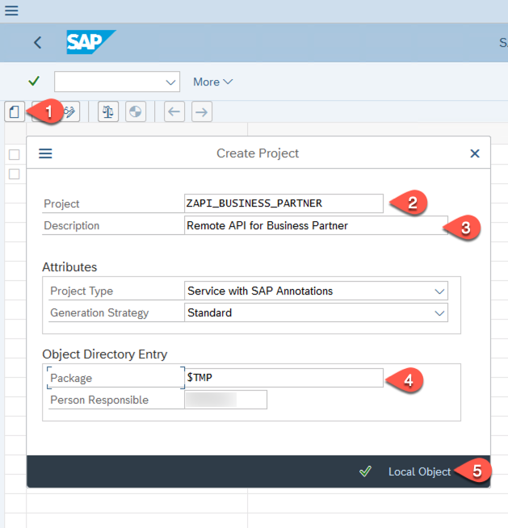

3. Navigate to **Data Model-> Import -> Data Model** from File

   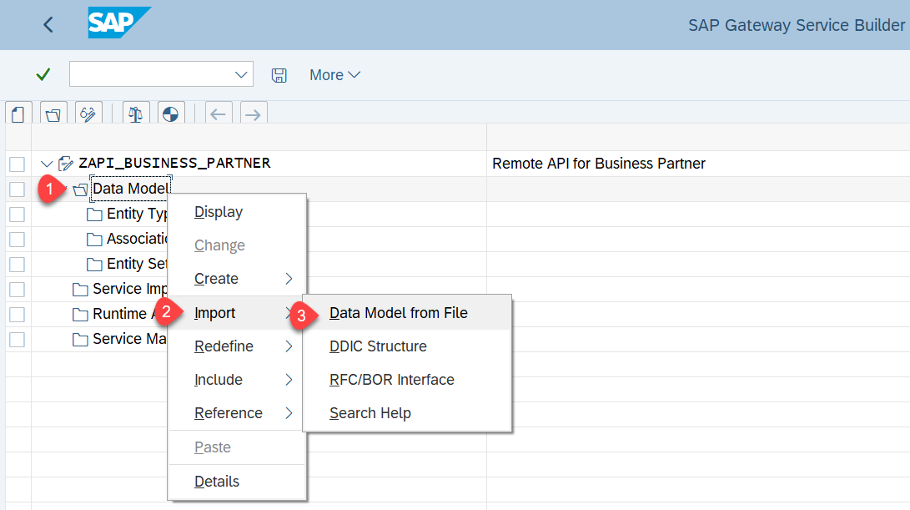

4. Import EDMX file of Downloaded API_BUSINESS_PARTNER using **Browse** and click on **Next**

   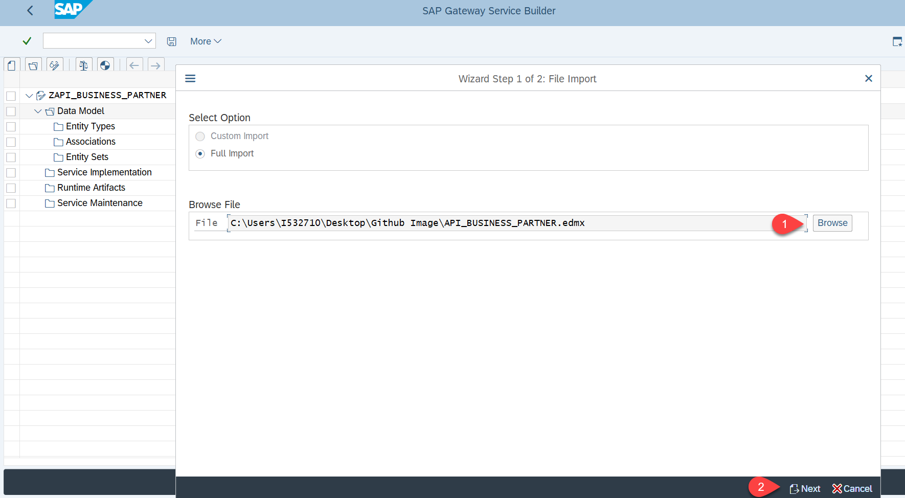

5. All entities got automatically imported through the EDMX file. Click on **Finish** .

   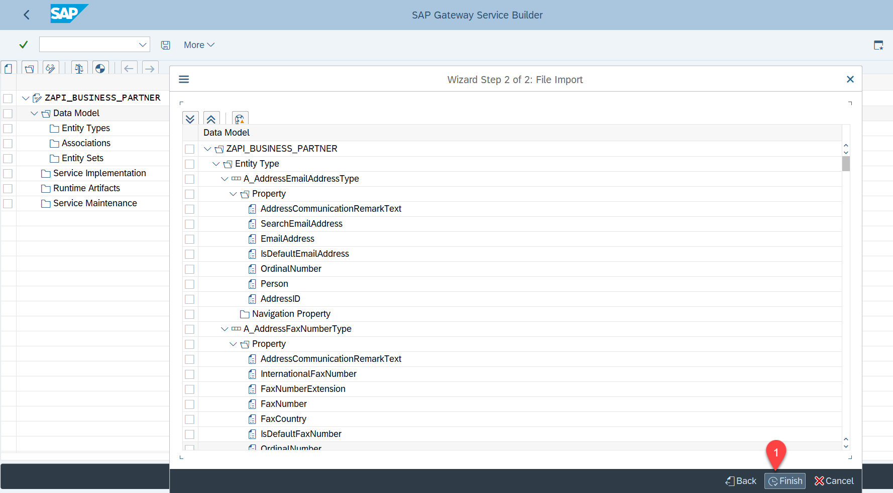

>Note: You might face issue of importing EDMX error due to conversion of data type. Please ignore it for this scenario. Continue for generation.

6. Click on **Generate** to enable **DPC**, **MPC**, **Model and Service** successfully. Save in **Local Package** or in **Transport**.
   Clicking on **Generate**, you will get a dialog box with message *Do You still want to generate runtime artifacts (yes/no)*. Here Select **Yes** to continue.

   

   The confirmation message below will display all details of DPC, MPC, Model and Service.

   

7. Navigate to **Service -> Runtime Artifacts -> Right-click on 'ZCL_ZAPI_BUSINESS_P_DPC_EXT' -> Select 'Go to ABAP Workbench'**. 

     

    

8. You will be navigated to **Data Provider Class Builder** where we implement all the CRUD related operation for the required entity set. **Expand Class -> Methods -> Inherited Methods**. This is the location, where you can find all the business entity. To implement the entity, we have to redefined each entity.

  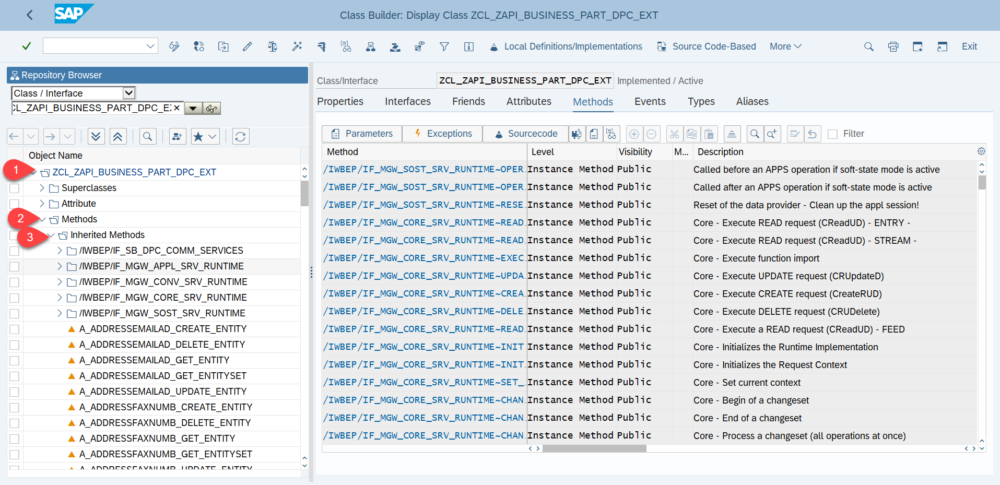

9. Find the first entity **A_BUSINESSPARTNE_GET_ENTITY** and redefine as shown below .

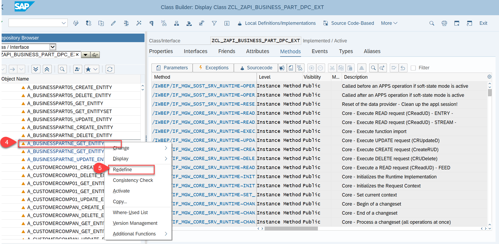

10. Copy and Paste the below Code in entity A_BUSINESSPARTNE_GET_ENTITY.

A_BUSINESSPARTNE_GET_ENTITY
------------------------
`````
METHOD a_businesspartne_get_entity.
*&----------------------------------------------------------------------------------------------*
*  & Object         : ZCL_ZAPI_BUSINESS_P_DPC_EXT=========A_BUSINESSPARTNE_GET_ENTITY
*  &--------------------------------------------------------------------------------------------*
*  & Purpose        : Retreive the Business Partner Full Name from ECC to populate in CAP

*  & Author         : Syed Ejazuddin(SAP)

*  &--------------------------------------------------------------------------------------------*
*  & Change Log : This Method has a scope for further extension and improvement
*  &--------------------------------------------------------------------------------------------*

*  &--------------------------------------------------------------------------------------------*
*  & Data Declaration
*  &--------------------------------------------------------------------------------------------*
  DATA: lv_partner        TYPE bu_partner,
        lv_central_person TYPE bapibus1006_central_person.

  TRY.
*Fetch the Business Partner ID which will be sent from from Cloud Application Programming.
        lv_partner = it_key_tab[ 1 ]-value.

* To avoid Leading zeroes issue, using conversion operator
        lv_partner = |{ lv_partner ALPHA = IN }|.

*Call below BAPI to fetch Business Partner Full Name from ECC for a Given ID
      CALL FUNCTION 'BAPI_BUPA_CENTRAL_GETDETAIL'
        EXPORTING
          businesspartner   = lv_partner         "Business Partner ID
        IMPORTING
          centraldataperson = lv_central_person. "BP Central Detail Structure

*Export the Business Partner ID and Full Name to Output Entity.
      IF sy-subrc = 0.
        er_entity-businesspartner         = |{ lv_partner ALPHA = OUT }|. "Business Partner
        er_entity-businesspartnerfullname = lv_central_person-fullname.   "Business Partner Full Name
      ENDIF.

    CATCH cx_sy_itab_line_not_found .
  ENDTRY.
ENDMETHOD.
````````````

11. After Pasting the Code, Save the Code and You will get message that Code is Saved. Then Check the Code that your syntax is correct. Last everything went without error, then Activate the object. Once the activation is successful you will get message in the below for successful activation. Please see the image below. 

    >Never do force Activation as it will dump the Object. If activation is giving error, revisit the prevous steps and ensure every steps as done properly.

   


12. Find the Second entity **A_BUSINESSPARTNE_GET_ENTITYSET** and redefine as shown below .


   
13. Copy and Paste the below Code in entity A_BUSINESSPARTNE_GET_ENTITYSET

A_BUSINESSPARTNE_GET_ENTITYSET
-----------------------
`````
METHOD a_businesspartne_get_entityset.
*&----------------------------------------------------------------------------------------------*
*  & Object         : ZCL_ZAPI_BUSINESS_P_DPC_EXT=========A_BUSINESSPARTNE_GET_ENTITYSET
*  &--------------------------------------------------------------------------------------------*
*  & Purpose        : Retreive the Business Partner Full Name from ECC to populate in CAP

*  & Author         : Syed Ejazuddin(SAP)

*  &--------------------------------------------------------------------------------------------*
*  & Change Log : This Method has a scope for further extension and improvement
*  &--------------------------------------------------------------------------------------------*

*  &--------------------------------------------------------------------------------------------*
*  & Data Declaration
*  &--------------------------------------------------------------------------------------------*
  DATA: lv_partner        TYPE bu_partner,
        lv_central_person TYPE bapibus1006_central_person.

  TRY.
*First fetch the Business Partner ID from Cloud Application Programming.
      lv_partner = |{ it_filter_select_options[ property = 'BusinessPartner' ]-select_options[ 1 ]-low ALPHA = IN }|.

*Call below BAPI to fetch Business Partner Full Name from ECC for a Given ID
      CALL FUNCTION 'BAPI_BUPA_CENTRAL_GETDETAIL'
        EXPORTING
          businesspartner   = lv_partner         "Business Partner ID
        IMPORTING
          centraldataperson = lv_central_person. "BP Central Detail Structure

*Export the Business Partner ID and Full Name to Output Entity.
      APPEND VALUE #( businesspartner         = |{ lv_partner ALPHA = OUT }| "Business Partner
                      businesspartnerfullname = lv_central_person-fullname   "Business Partner Full Name
                      ) TO et_entityset.

    CATCH cx_sy_itab_line_not_found .
  ENDTRY.
ENDMETHOD.
`````
14. After Pasting the Code, Save the Code and You will get message that Code is Saved. Then Check the Code that your syntax is correct. Last everything went without error, then Activate the object. Once the activation is successful you will get message in the below for successful activation. Please see the image below. 

    >Never do force Activation as it will dump the Object. If activation is giving error, revisit the prevous steps and ensure every steps as done properly.

   


15. Find the third entity **A_BUSINESSPARTNE_UPDATE_ENTITY** and redefine as shown below .

   
    
16. Copy and Paste the below Code in entity A_BUSINESSPARTNE_UPDATE_ENTITY

A_BUSINESSPARTNE_UPDATE_ENTITY
--------------------

````````
  METHOD a_businesspartne_update_entity.
*&----------------------------------------------------------------------------------------------*
*  & Object         : ZCL_ZAPI_BUSINESS_P_DPC_EXT=========A_BUSINESSPARTNE_UPDATE_ENTITY
*  &--------------------------------------------------------------------------------------------*
*  & Purpose         : Once the verification status updated from Cloud Application Programming,
*                      this method update the Search Term1 Field & Activate the business Partner.

*  & Author         : Syed Ejazuddin(SAP)

*  &--------------------------------------------------------------------------------------------*
*  & Change Log : This Method has a scope for further extension and improvement
*  &--------------------------------------------------------------------------------------------*

*  &--------------------------------------------------------------------------------------------*
*  & Data Declaration
*  &--------------------------------------------------------------------------------------------*
    DATA: es_table     TYPE zcl_zapi_business_part_mpc=>ts_a_businesspartnertype,
          ls_central   TYPE bapibus1006_central,
          ls_central_x TYPE bapibus1006_central_x,
          lv_partner   TYPE bu_partner.

    TRY.
*Fetch the Business Partner ID which will be sent from Cloud Application Programming.
        lv_partner = it_key_tab[ 1 ]-value.

* To avoid Leading zeroes issue, using conversion operator
        lv_partner = |{ lv_partner ALPHA = IN }|.

*Below Statement will retrive all the field of BP Central Detail which needs to be updated from CAP
        io_data_provider->read_entry_data( IMPORTING es_data = es_table ).

*Pass the SearchTerm1 field updated values and it's indicator from CAP to local structure
        ls_central-searchterm1 = es_table-searchterm1.
        ls_central_x-searchterm1 = abap_true.

*Pass the businesspartnerisblocked field updated values and it's indicator from CAP to local structure
        ls_central-centralblock = es_table-businesspartnerisblocked.
        ls_central_x-centralblock = abap_true.

*Pass the Search Term1 and Status of Business Partner to BAPI for updation
        CALL FUNCTION 'BAPI_BUPA_CENTRAL_CHANGE'
          EXPORTING
            businesspartner = lv_partner    "Business Partner ID
            centraldata     = ls_central    "Local Structure Containing updated field
            centraldata_x   = ls_central_x. "Local Structure Containing updated field Indicator

*Commit the BAPI to ensure successful Updation of Business Partner Cenral Data
        CALL FUNCTION 'BAPI_TRANSACTION_COMMIT'.

      CATCH cx_sy_itab_line_not_found .
    ENDTRY.

  ENDMETHOD.
````````

17. After Pasting the Code, Save the Code and You will get message that Code is Saved. Then Check the Code that your syntax is correct. Last everything went without error, then Activate the object. Once the activation is successful you will get message in the below for successful activation. Please see the image below. 

    >Never do force Activation as it will dump the Object. If activation is giving error, revisit the prevous steps and ensure every steps as done properly.

   

18. Find the fourth entity **A_BUSINESSPART01_GET_ENTITY** and redefine as shown below .


19. Copy and Paste the below Code in entity A_BUSINESSPART01_GET_ENTITY.

A_BUSINESSPART01_GET_ENTITY
------------------------
`````
METHOD A_BUSINESSPART01_GET_ENTITY.
*&----------------------------------------------------------------------------------------------*
*  & Object         : ZCL_ZAPI_BUSINESS_P_DPC_EXT=========A_BUSINESSPART01_GET_ENTITY
*  &--------------------------------------------------------------------------------------------*
*  & Purpose        : Retreive Business Partner and Address from ECC for a specific Business Partner
*                     ID which will be requested from Cloud Application Programming. Not Valid
*                     to mock Address of every Business Partner in a system.

*  & Author         : Syed Ejazuddin(SAP)

*  &--------------------------------------------------------------------------------------------*
*  & Change Log : This Method has a scope for further extension and improvement
*  &--------------------------------------------------------------------------------------------*

*  &--------------------------------------------------------------------------------------------*
*  & Data Declaration
*  &--------------------------------------------------------------------------------------------*
 DATA: lv_partner TYPE bu_partner,
       ls_address TYPE bapibus1006_address,
       lv_addr_no TYPE ad_addrnum,
       lt_ad_rem TYPE TABLE OF bapiad_rem.

    TRY.
*Fetch the Business Partner ID which will be sent from from Cloud Application Programming.
        lv_partner = it_key_tab[ 1 ]-value.

* To avoid Leading zeroes issue, using conversion operator
        lv_partner = |{ lv_partner ALPHA = IN }|.

*Get the Business Partner Address Number from the below BAPI by Passing Business Partner Number
        CALL FUNCTION 'BAPI_BUPA_ADDRESS_GET_NUMBERS'
          EXPORTING
            businesspartner = lv_partner  "Business Partner
          IMPORTING
            addr_no_out     = lv_addr_no.  "Address Number

*Fetch the Address Detail of Business Partner
      CALL FUNCTION 'BUPA_ADDRESS_GET_DETAIL'
        EXPORTING
          iv_partner = lv_partner  "Business Partner
        IMPORTING
          es_address = ls_address  "Address Detail
        TABLES
          et_ad_rem  = lt_ad_rem.

      IF sy-subrc = 0.
        er_entity-businesspartner = |{ lv_partner ALPHA = OUT }|. "Business Partner
        er_entity-addressid       = |{ lv_addr_no ALPHA = OUT }|. "Address Number
        er_entity-streetname      = ls_address-street.            "Street
        er_entity-postalcode      = ls_address-postl_cod1.        "Postal Code
      ENDIF.

      CATCH cx_sy_itab_line_not_found .
    ENDTRY.
ENDMETHOD.
`````````````````````

20. After Pasting the Code, Save the Code and You will get message that Code is Saved. Then Check the Code that your syntax is correct. Last everything went without error, then Activate the object. Once the activation is successful you will get message in the below for successful activation. Please see the image below. 

    >Never do force Activation as it will dump the Object. If activation is giving error, revisit the prevous steps and ensure every steps as done properly.

   

21. Find the fifth entity **A_BUSINESSPART01_GET_ENTITYSET** and redefine as shown below .

   
  
22. Copy and Paste the below Code in entity A_BUSINESSPART01_GET_ENTITYSET

A_BUSINESSPART01_GET_ENTITYSET
-----------------

````````
  METHOD a_businesspart01_get_entityset.
*&----------------------------------------------------------------------------------------------*
*  & Object         : ZCL_ZAPI_BUSINESS_P_DPC_EXT=========A_BUSINESSPARTNE_GET_ENTITYSET
*  &--------------------------------------------------------------------------------------------*
*  & Purpose        : Retreive Business Partner and Address from ECC for a specific Business Partner
*                     ID which will be requested from Cloud Application Programming. Not Valid
*                     to mock Address of every Business Partner in a system.

*  & Author         : Syed Ejazuddin(SAP)

*  &--------------------------------------------------------------------------------------------*
*  & Change Log : This Method has a scope for further extension and improvement
*  &--------------------------------------------------------------------------------------------*

*  &--------------------------------------------------------------------------------------------*
*  & Data Declaration
*  &--------------------------------------------------------------------------------------------*
    DATA: lt_ad_rem  TYPE TABLE OF bapiad_rem,
          lt_return  TYPE TABLE OF bapiret2,
          lv_partner TYPE bu_partner,
          ls_address TYPE bapibus1006_address,
          lv_addr_no TYPE ad_addrnum.

    TRY.
*First fetch the Business Partner ID from Cloud Application Programming.
        lv_partner = |{ it_filter_select_options[ property = 'BusinessPartner' ]-select_options[ 1 ]-low ALPHA = IN }|.

*Get the Business Partner Address Number from the below BAPI by Passing Business Partner Number
        CALL FUNCTION 'BAPI_BUPA_ADDRESS_GET_NUMBERS'
          EXPORTING
            businesspartner = lv_partner  "Business Partner
          IMPORTING
            addr_no_out     = lv_addr_no.  "Address Number

*Get the Business Partner and Address from the below BAPI by Passing Business Partner Number
        CALL FUNCTION 'BUPA_ADDRESS_GET_DETAIL'
          EXPORTING
            iv_partner = lv_partner       "Business Partner
          IMPORTING
            es_address = ls_address       "Address Detail
          TABLES
            et_ad_rem  = lt_ad_rem.       "Return Table

*Export all the Fetched detail to Output Entity of Business Partner
        APPEND VALUE #( businesspartner  = |{ lv_partner ALPHA = OUT }| "Business Partner
                        addressid        = |{ lv_addr_no ALPHA = OUT }| "Address Number
                        streetname       = ls_address-street            "Street
                        postalcode       = ls_address-postl_cod1        "Postal Code
                        cityname         = ls_address-city              "City
                        country          = ls_address-country           "Country
                       ) TO et_entityset.

      CATCH cx_sy_itab_line_not_found .
    ENDTRY.

  ENDMETHOD.
`````````

23. After Pasting the Code, Save the Code and You will get message that Code is Saved. Then Check the Code that your syntax is correct. Last everything went without error, then Activate the object. Once the activation is successful you will get message in the below for successful activation. Please see the image below. 

    >Never do force Activation as it will dump the Object. If activation is giving error, revisit the prevous steps and ensure every steps as done properly.

   

24. Find the sixth entity **A_BUSINESSPART01_UPDATE_ENTITY** and redefine as shown below .

   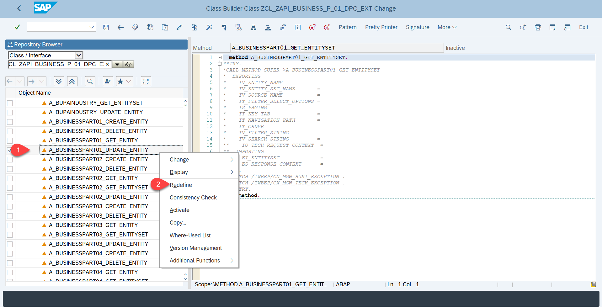
    
25. Copy and Paste the below Code in entity A_BUSINESSPART01_UPDATE_ENTITY

A_BUSINESSPART01_UPDATE_ENTITY
-----------------

````````
  METHOD a_businesspart01_update_entity.
*&----------------------------------------------------------------------------------------------*
*  & Object         : ZCL_ZAPI_BUSINESS_P_DPC_EXT=========A_BUSINESSPART01_UPDATE_ENTITY
*  &--------------------------------------------------------------------------------------------*
*  & Purpose        : This methods provides the scope for correct wrong address of Business Partner
*                     from Cloud Application Program.

*  & Author         : Syed Ejazuddin(SAP)

*  &--------------------------------------------------------------------------------------------*
*  & Change Log : This Method has a scope for further extension and improvement
*  &--------------------------------------------------------------------------------------------*

*  &--------------------------------------------------------------------------------------------*
*  & Local Data Declaration
*  &--------------------------------------------------------------------------------------------*
    DATA: es_table     TYPE zcl_zapi_business_part_mpc=>ts_a_businesspartneraddresstyp,
          ls_address   TYPE bapibus1006_address,
          ls_address_x TYPE bapibus1006_address_x,
          lv_partner   TYPE bu_partner,
          lt_return    TYPE TABLE OF bapiret2.

    TRY.
*Fetch the Business Partner ID which will be sent from from Cloud Application Programming.
        lv_partner = it_key_tab[ 1 ]-value.

* To avoid Leading zeroes issue, using conversion operator
        lv_partner = |{ lv_partner ALPHA = IN }|.

*Below Statement will retrive all the field of BP Address which needs to be updated from CAP
        io_data_provider->read_entry_data( IMPORTING es_data = es_table ).

*Pass the StreetName field updated values and it's indicator from CAP to local structure
        ls_address-street = es_table-streetname.
        ls_address_x-street = abap_true.

*Pass the PostalCode field updated values and it's indicator from CAP to local structure
        ls_address-postl_cod1 = es_table-postalcode.
        ls_address_x-postl_cod1 = abap_true.

*Pass the StreetName and PostalCode of Business to BAPI for updation
        CALL FUNCTION 'BAPI_BUPA_ADDRESS_CHANGE'
          EXPORTING
            businesspartner = lv_partner    "Business Partner ID
            addressdata     = ls_address    "Local Structure Containing updated field
            addressdata_x   = ls_address_x  "Local Structure Containing updated field Indicator
          TABLES
            return          = lt_return.    "Internal Table to capture updation status

*Commit the BAPI to ensure successful Updation of Business Address
        CALL FUNCTION 'BAPI_TRANSACTION_COMMIT'.

      CATCH cx_sy_itab_line_not_found .
    ENDTRY.
  ENDMETHOD.
``````````````````````

26. After Pasting the Code, Save the Code and You will get message that Code is Saved. Then Check the Code that your syntax is correct. Last everything went without error, then Activate the object. Once the activation is successful you will get message in the below for successful activation. Please see the image below. 

    >Never do force Activation as it will dump the Object. If activation is giving error, revisit the prevous steps and ensure every steps as done properly.

   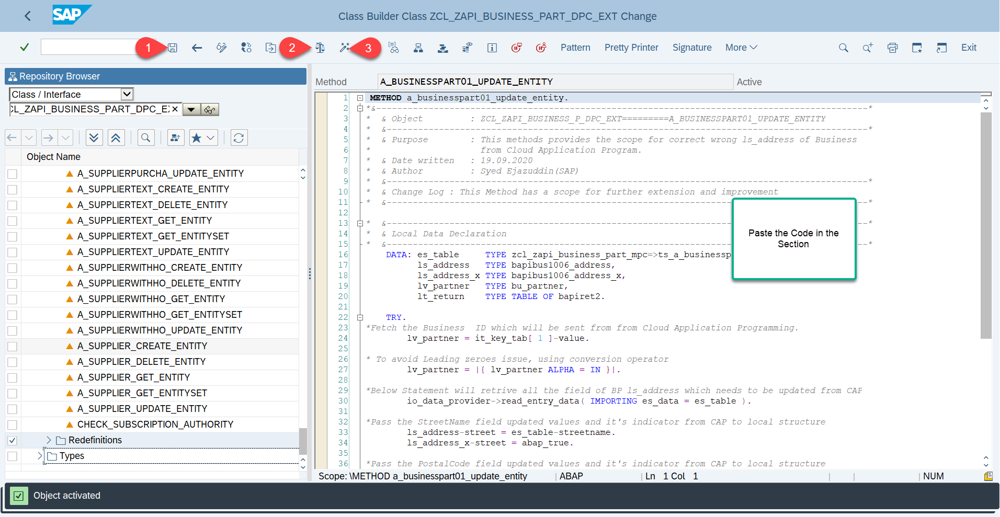

27. Navigate to Transaction **/n/iwfnd/maint_service** and click on **Add Service** to register the service.

     

28. Follow the below steps to register newly created Business Partner in Gateway.
    * **Set System-Alias** = *LOCAL*
    * Search for **API_BUSINESS_PARTNER**
    * Add selected service
    * Click on **ZAPI_BUSINESS_PARTNER_SRV**

     

     * Set **Package Assignment** = *$TMP*
     * Click on the green check mark (**OK**).

     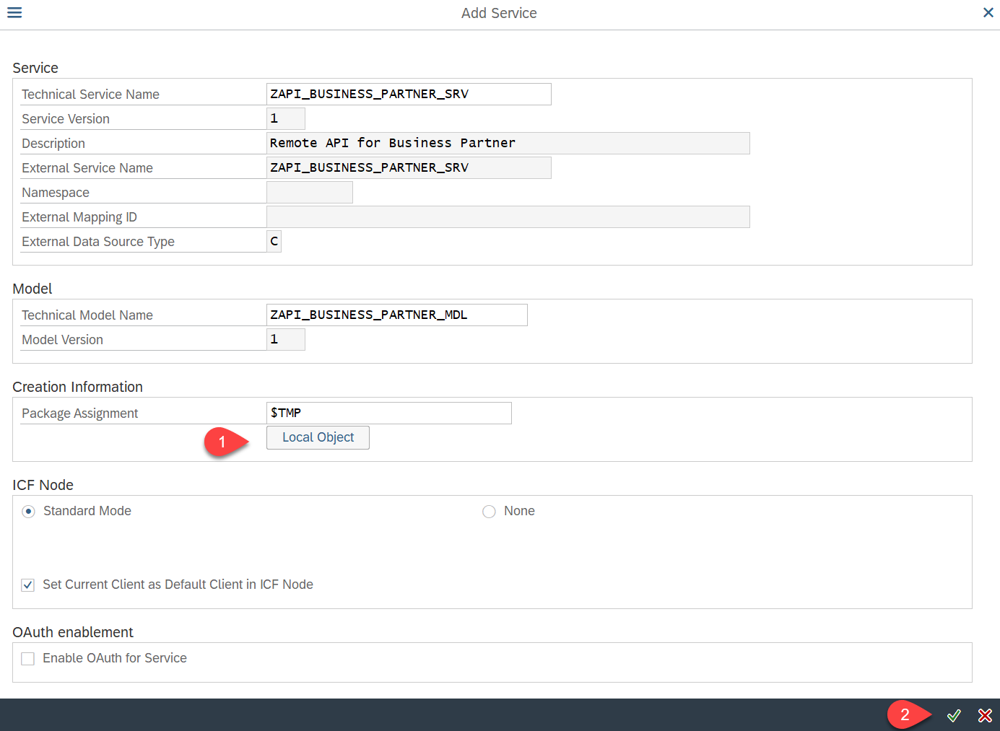

29. Once it's registered, you will see the service in your gateway service catalog

    

## Test Your Service

1. Double Click on **ZAPI_BUSINESS_PARTNER_SRV** and Click on **SAP Gateway Client**

    

30. Click on **Execute** and you will see *status code 200* in your response body. Status Code other than *200* means some error in service activation.

    

31. Change the Requested URI and put **A_BusinessPartner** after service like below. Click on **Execute** and you will see *status code 200* in your response body. Status Code other than *200* means some error in service activation.

    

**Error Handling:** 

If you get an *HTTP 40x error* check the following:
      

* Call transaction **/nSICF** and activate **sap/opu/odata/sap/zapi_business_partner** service

    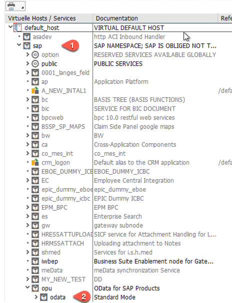

    

* Call transaction **/nSPRO**
    * Select **SAP Reference IMG**
    * Activate **SAP Gateway**

    

    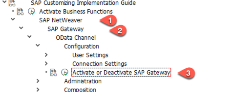


32.  Change the Requested URI and put **A_BusinessPartnerAddress** after Service like below. Click on **Execute** and you will see *status code 200*  in your response body. Status code other than *200* means some error in service activation.

     


### Optional:

33. To see the metadata, add *$metadata* at the end of the URL. You will see **API_BUSINESS_PARTNER** namespace in EDMX.

    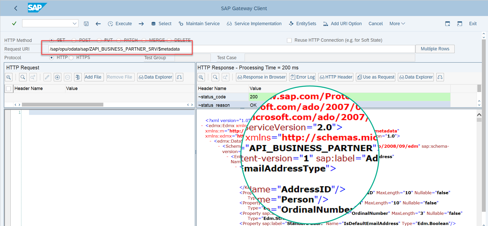


## Summary
We have create a custom Business Partner service by using the S/4HANA Business Partner API as a template. We have implemented some of the **GET**, **CREATE** and **UPDATE** methods for the Business Partner API. Be aware this is only a partial implementation for demonstrating the event handling. For a full OData API you have to implement further methods and functionalities.
