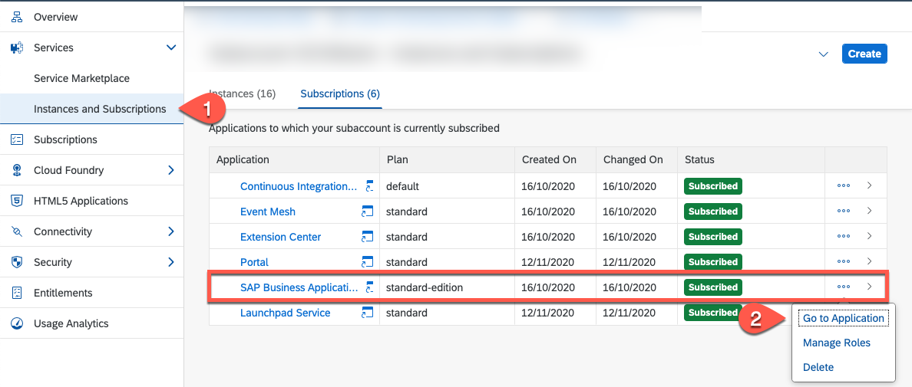
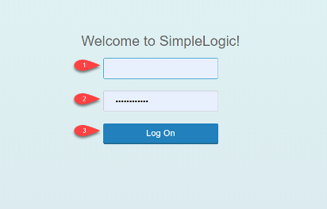
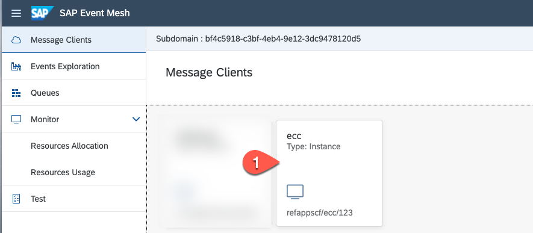
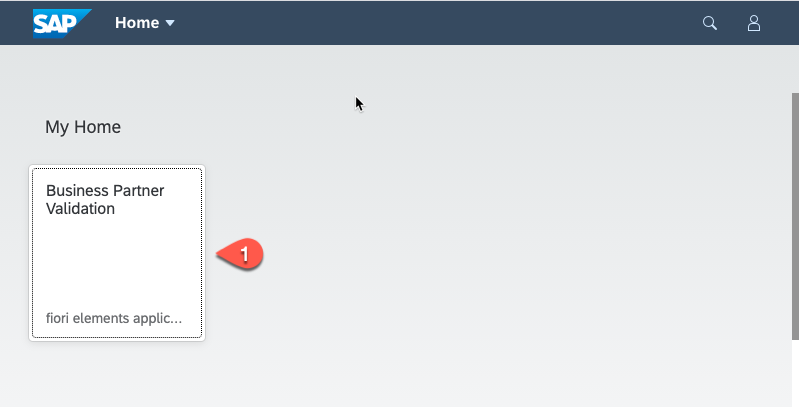
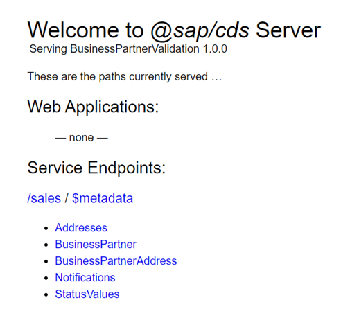

# Setup the SAP Cloud Application Programming Model Application

## Introduction

In this section we will configure our reference application, create the necessary service instances for the SAP HANA DB, enterprise messaging, security and connectivity. Deploy the application to your SAP Cloud Platform account and run a first test.
 
 The application structure is based on the SAP Cloud Application Programming Model (CAP)
 If you want to know how to build such an application from scratch please check the [CAP Documentation](https://cap.cloud.sap/docs/) or take a look at [Mission: Extend SAP S/4HANA On Premise business processes on SAP Cloud Platform](https://platformx-ad17b8dc3.dispatcher.hana.ondemand.com/protected/index.html#/missiondetail/3242/3268) where the local development part is shown.

The SAP Cloud Application project contains below folders and files:

File / Folder | Purpose
---------|----------
`app/` | content for the UI frontend (Fiori Elements) go here 
`db/` | your domain cds models and data go here
`srv/` | your service models and code go here
`srv/external` | the reference to the external Business Partner service
`srv/external/data` | some sample data for the demo app
`srv/service.js` | the implementation of the service model 
`package.json` | project metadata and configuration
`em.json` | the configuration file for the enterprise messaging service
`xs-security.json` | the configuration file for the xsuaa service
`mta.yaml` | the multi target application build file


**Persona:** Cloud Application Developer

## Step-by-step
### Create a new application in SAP Business Application Studio

1.	Make sure you have opened your *SAP Cloud Platform Account* and navigate to your *Subaccount* 
   
2.	Open the menu *Subscriptions* and then search for 'Business Application Studio'. Click on *Go to Application*.

    
   
3.	Open the application 'Business Application Studio' and login via your username and password

     
 
4.	In Business Application Studio click the button *Create Dev Space*

     
 
5.	On the next screen enter a Dev space name e.g 'mission', select the type *SAP Cloud Business Application*. Click on the button *Create Dev Space*

      
      
 
6.	Your Dev Space is now being created. As soon as the Dev Space is available you can click on your Dev Spaces name to  access

7.	Choose *Terminal -> New Terminal* in the menu on the top of your screen.

    
 
8. Go to projects Folder
   
   ```bash 
   cd projects
   ``` 
 
9.	Clone the project from the SAP samples application repository 

    ```bash
    git clone https://github.com/SAP-samples/cloud-extension-ecc-business-process.git 
     ```
 
10.	Click on *File* in the menu on the top and choose *Open Workspace* in the drop down.

    
 
11.	Open the project by selecting projects -> cloud-cap-ecc-bp and click on *Open*

 

1.  First you need to login to your SAP Cloud Platform account:
 
   * Check if you are logged in to your Cloud Platform Account from *SAP Business Application Studio*.
     
   * To login to Cloud Foundry, In the tabs, click on View-> Select “Find Command”.
    
   * Search for “CF Login”.
    
   * Select for “CF: Login on to Cloud Foundry”.

      
    
   * Enter CF API endpoint or take the default suggested API endpoint. You can find the API endpoint of your region by switching into your SAP Cloud Platform account browser window and copy the API Endpoint. Also write down the 'Org Name' into a text editor of your choice which is needed for the next step.  

     
    
   * Choose 'Spaces' and write down the space name to a text editor of your choice. 

     
     
   * Enter “Email” and “Password” when prompted.
   * Select your Cloud Foundry "Org" which you have noted down in step before 
   * Select the space name which you have noted down. Once you have selected the Org and Space, you would login to your Cloud Foundry account from SAP Business Application Studio.


13. For the next steps you need the terminal again. Go to *Terminal* -> *New Terminal*
         
   i. First we create a hdi-shared database instance, therefore we need the guid of the SAP HANA Cloud service that we have created at the [SAP Cloud Platform Setup](../scp-setup/README.md). You can find the service name in the list of services
      
```bash
 cf services    
    
 cf service <HANA-Service> --guid
```

 With the guid we can create a hdi-shared database instance:
      
   ```bash
    cf cs hana hdi-shared BusinessPartnerValidation-db -c '{"database_id" : "<guid of HANA Service>"}'
   ```   
            
   
   ii. In a next step, you will create a number of services e.g. for connection and Enterprise Messaging. You will do this by executing the following Cloud Foundry create service commands.
   
   * Create enterprise-messaging instance using the em.json configuration file in your project.
     
     ```bash
     cf cs enterprise-messaging default BusinessPartnerValidation-ems -c em.json
     ```

   * Create a destination instance
  
     ```bash
     cf cs destination lite BusinessPartnerValidation-dest
     ```

   * Create a xsuaa instance using the xs-security.json configuration file in your project.
    
     ```bash
     cf cs xsuaa application BusinessPartnerValidation-xsuaa -c xs-security.json
     ```    

  * Create a connectivity instance for accessing SAP Cloud Connector.  

    ```bash
    cf cs connectivity lite BusinessPartnerValidation-cs        
    ```

  * Generate a service key we will this later for binding services 
   
     ```bash
     cf create-service-key BusinessPartnerValidation-ems emkey
    ```

  * Build the application  
    
    ```bash
    cds build --production
    ```

> HINT: there is an additional way of deployment - either execute the steps before or the two below to achieve the same result: Run *mbt build -p=cf* followed by cf *deploy mta_archives/BusinessPartnerValidation_1.0.0.mtar*

     

13.	Open the gen/srv/manifest.yaml file and add your service names / replace existing ones with your services: ems, dest, xsuaa, database.  
Set the Memory as 256MB.

> Hint: to make sure that the services names match, execute the CF command *CF services* which lists the services you have created including their names.

 
 
14. Create a queue in Enterprise Messaging for the application to read events from SAP S/4HANA.

- Go to the SAP Cloud Platform Cockpit
- Click on Subscriptions
- Click on "Go to Application" for Enterprise Messaging


- Login using email and password


- Click on your message client



- Click on Queues.
- Click on Create Queue
- Provide name for the queue - BusinessPartnerValidation-srv/a75c. Including the namespace, the name would be 'refappscf/ecc/123/BusinessPartnerValidation-srv/a75c'
- Click on Create

15.	Go back to the terminal and run following commands:

       ```bash
       //generate the database instance deploy the database content
       cf p -f gen/db
       
       //generate the service instances and deploy the service
       cf p -f gen/srv --random-route
       ```
 
16.   Check if the mta.yaml file exist in the project root - if not create one
     
     ```bash
     cds add mta
     ```
    
     Then replace the content with this [mta](./mta.yaml) 

17.  Generate the mtar file
    
    ```bash
    mbt build -p=cf
    ```

18.  Deploy the UI and service to your Cloud Foundry space with the mtar.
    
    ```bash
    cf deploy mta_archives/BusinessPartnerValidation_1.0.0.mtar
    ```

### Test your application

1. Go to the terminal and enter *cf apps*.

 

2. Copy the BusinessPartnerValidation-ui url.

3. Open a new browser tab and paste the URL in there.

 

4. Copy the BusinessPartnerValidation-srv url and open it in a new browser tab.

 

 ## Summary

 We have done the configuration for the reference application. We created the instances for the required services and deployed the application to our SAP Cloud Platform space. In the next steps we configure the eventing on cloud and on-premise and then we are ready to run the application.


