# Test Entire Business Scenario End to End
----------------
## Access Frontend Application

1. Go to your **SAP Cloud Platform Subaccount** and go to corresponding **Space**

   

2. Access **Space** and select the **UI Application**

   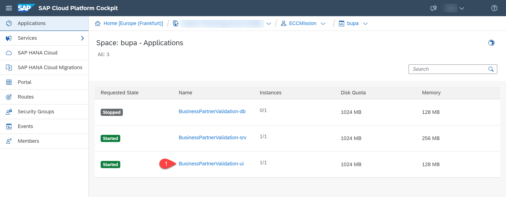

   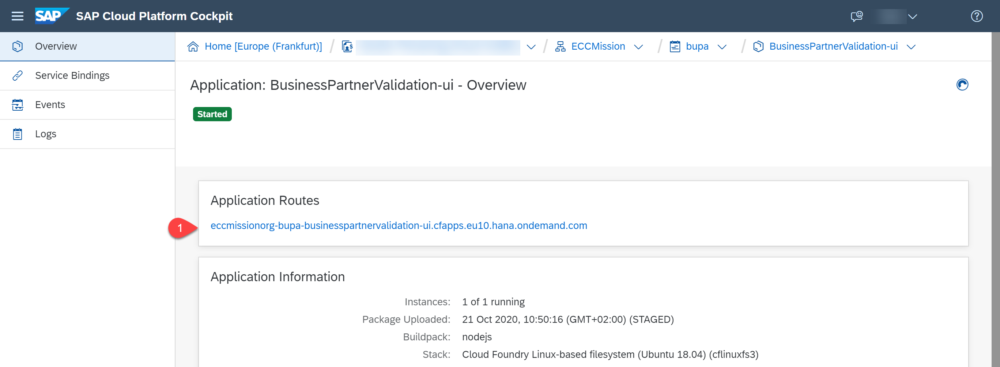

3. Start your Business Partner Validation Application

   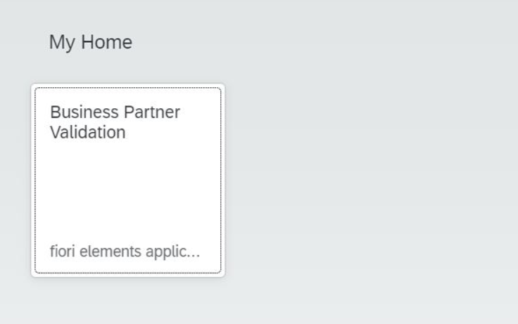

   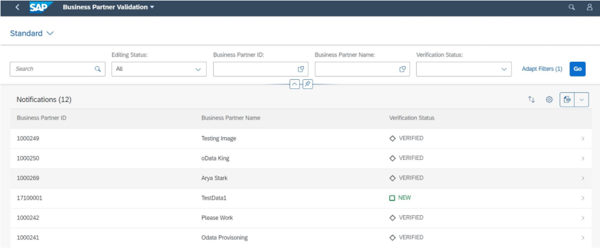

## Add new Business Partner in Backend

1. Login to your ECC System backend with **SAP Logon**

   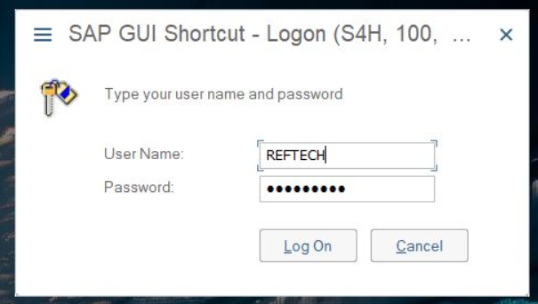

2. Go to transaction **bp**

   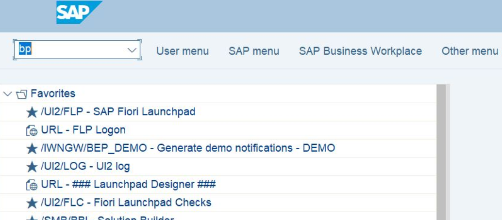

3. Create a new **Business Partner**

    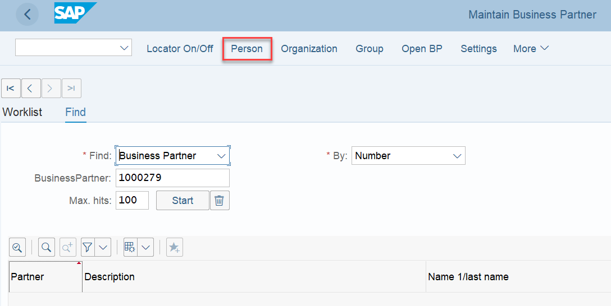

    * Add address

    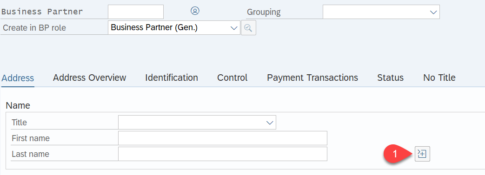

    * Enter Full Name

    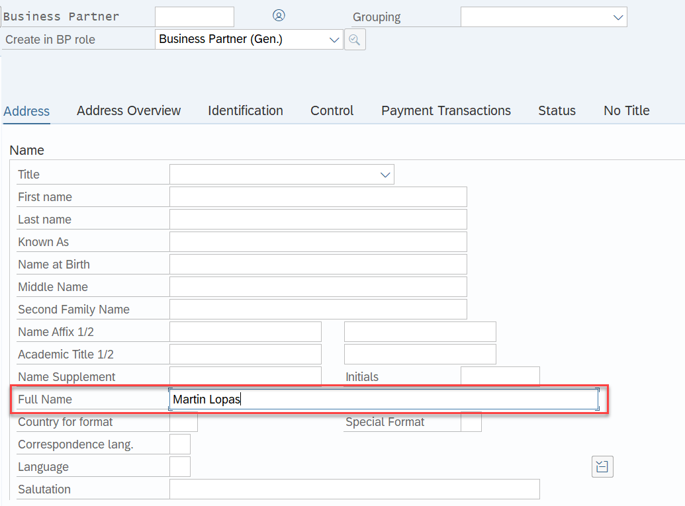

    * Enter Street, Postal Code, City and Country

    

    * Set the Status to Central Block and click on Save

    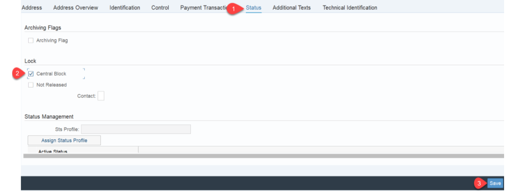

## Change Adress and Verify Business Partner in Frontend

1. Back at the reference application the newly created Business Partner is going to appear in the list of Business Partners

    

2. Click on the new **Business Partner**

    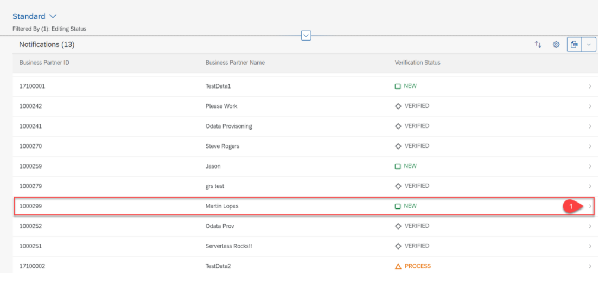

3. Click on **Edit**

    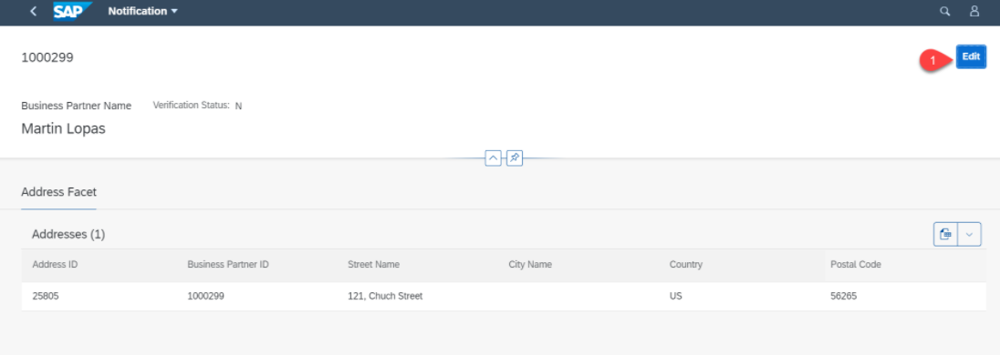

4.  Change the **Address**, set the Status to **Verified** and click **Save**

    

    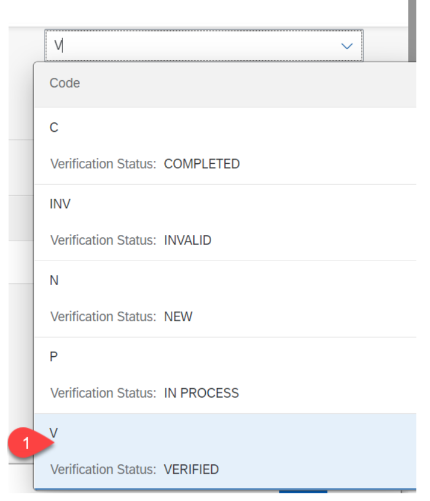

## Check Status of Business Partner in Backend

1. Go back to transaction **bp** in ECC System

    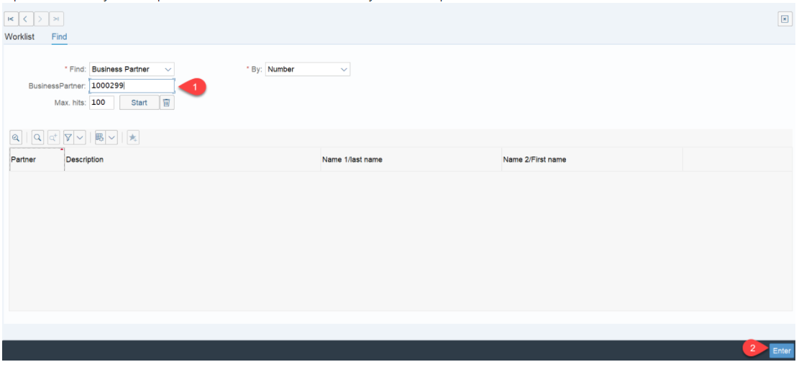

2. Open the details of the Business Partner you have just set to **Verified**

    

3. **Search Term** field will be set to **Verified** and **Address** field will also reflect updated field.

    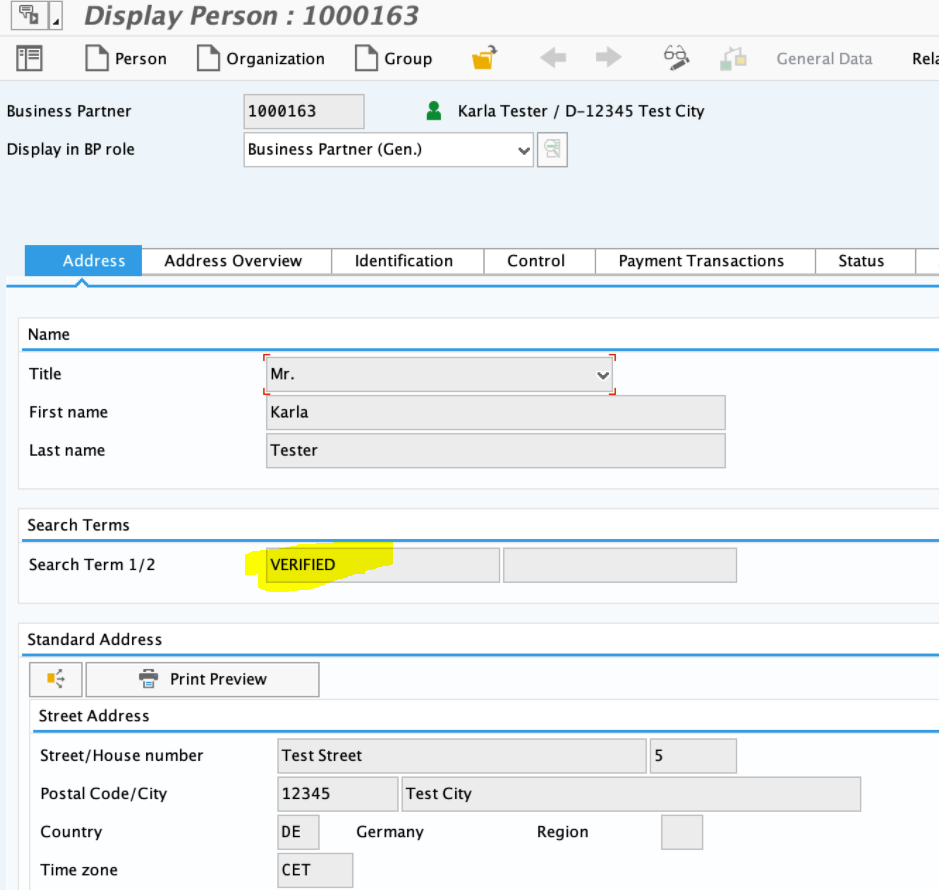

4. Go to the **Status** tab and check whether the **Central Block** flag has been removed

    

## Logs and Troubleshooting

- Additionally you can check the logs of SAP NetWeaver Add-On for Event enablement as described in the chapter [Monitoring and Logging](https://help.sap.com/viewer/e966e6c0e61443ebaa0270a4bae4b363/1.0/en-US/cff1acd831f744d59697525702ed0d3e.html).

- Logs for your Serverless Function can be found in the Extension Center:

    

    

    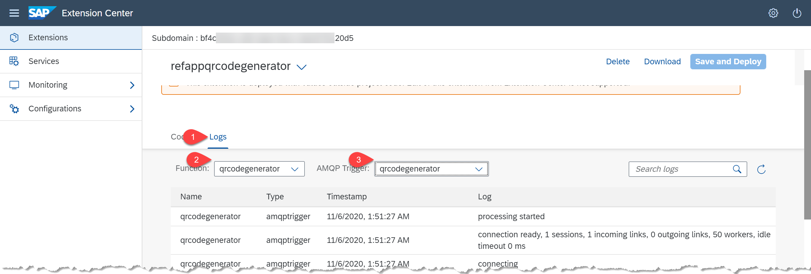

    

- To monitor the Events from ECC open Transaction **SLG1** on your Backend

    

    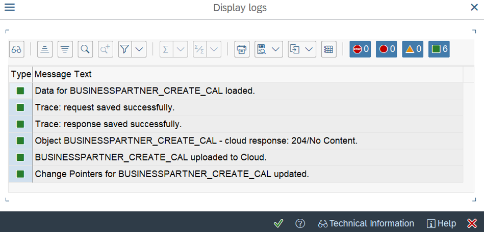

- In Transaction **SLG1** you can even view the trace of an event by choosing **More -> Views -> Show Trace**

    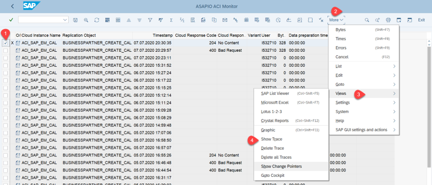

    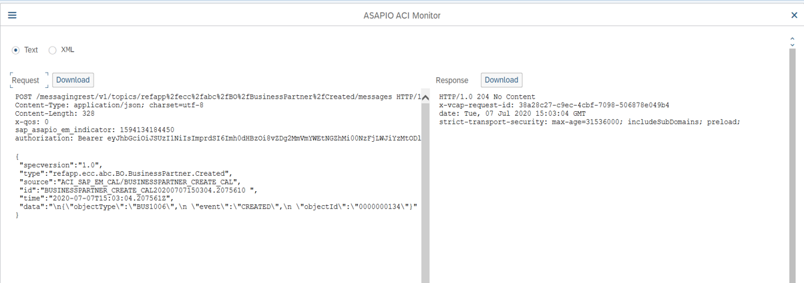

- The regular SAP Cloud Platform Logs might also be helpful. Access the corresponding **Space** in your **Subaccount**. Then choose your Application and **Logs**.

    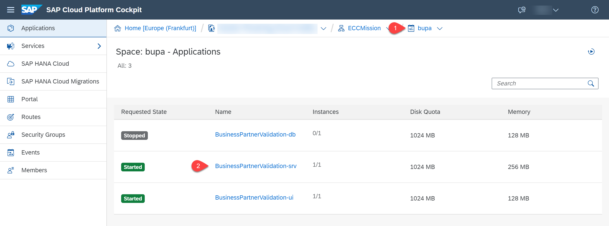

    

- If you get the following error in the demo application log, check your the [Virus Scan setup](https://help.sap.com/doc/saphelp_nw751abap/7.51.0/en-US/b5/5d22518bc72214e10000000a44176d/frameset.htm) of your backend.
    
     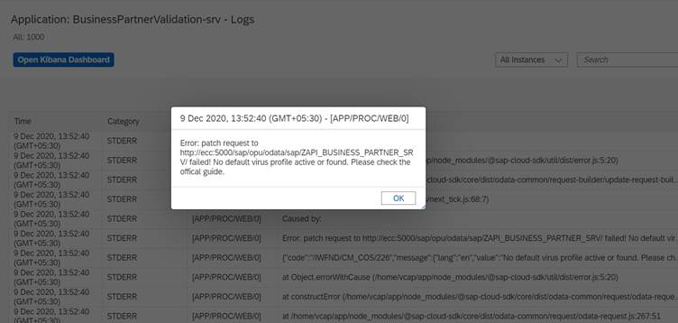

