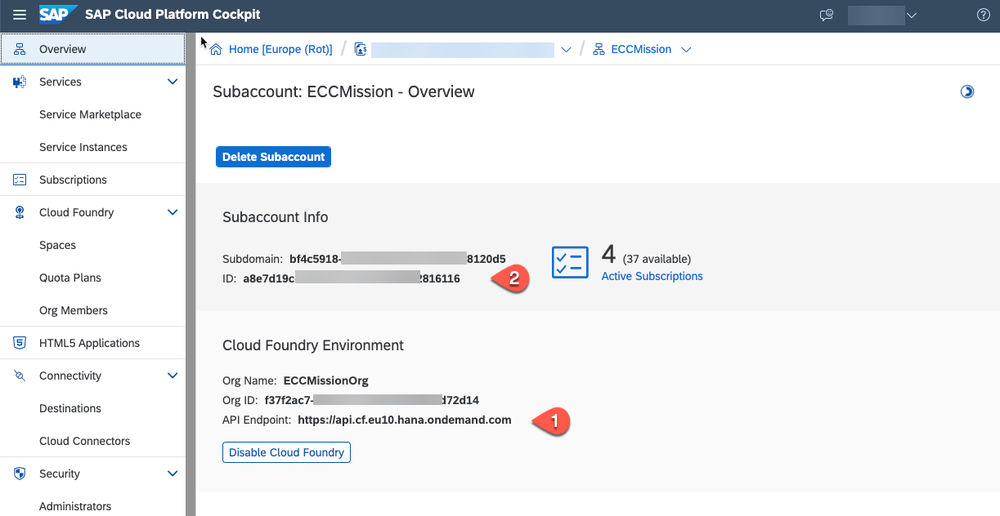
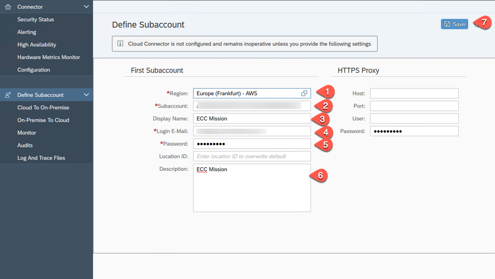
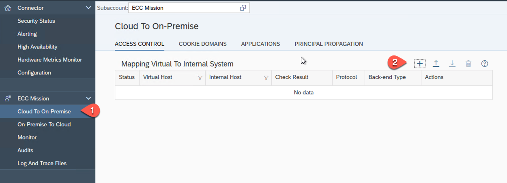
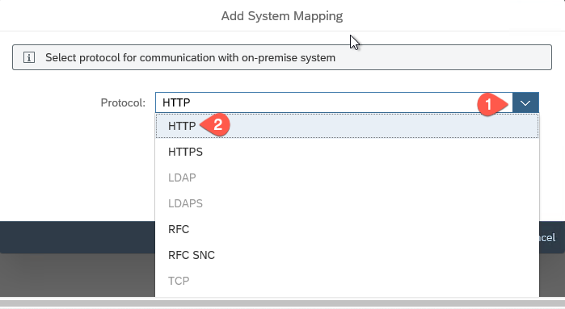
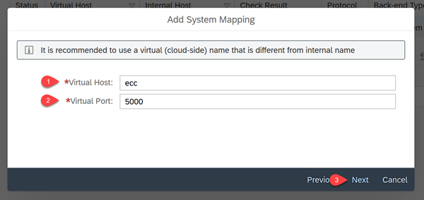
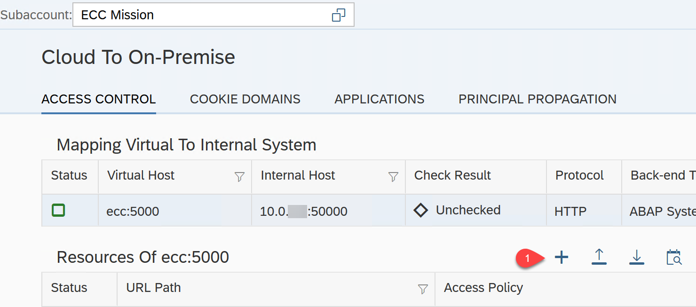
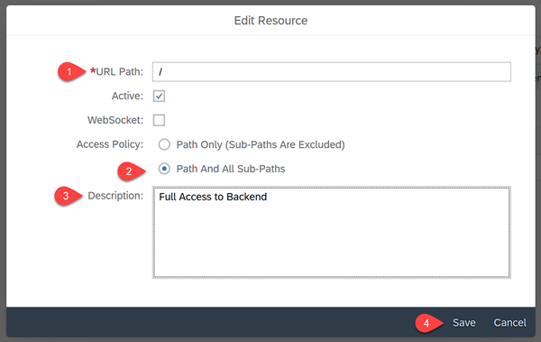
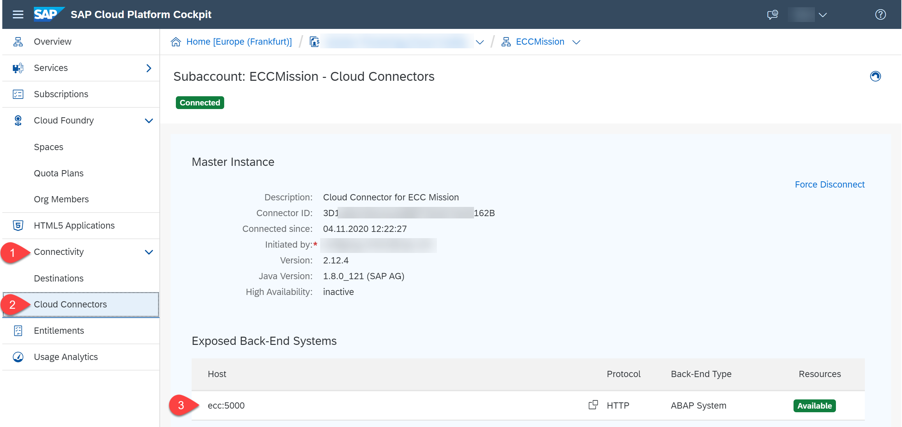
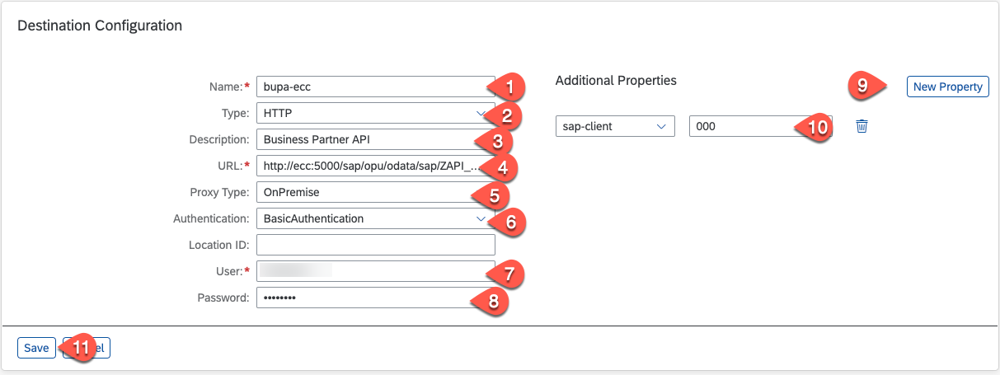
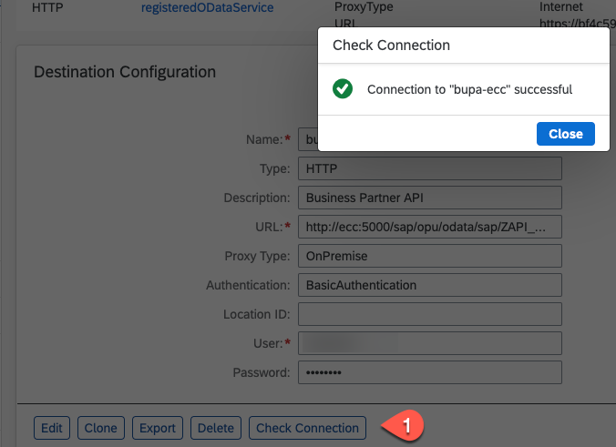

# Configure systems in Cloud Connector

In this section you will configure the SAP Cloud Connector for connecting the on premise backend system to the SAP Cloud Platform.

**Persona:** Backend (ERP) Admin and SCP Admin

## Preparations

### SAP Cloud Connector
For the installation of the SAP Cloud Connector please follow the steps in the SAP Help document - for this mission the Portable Scenario would be sufficient.

[SAP Help: Cloud Connector Installation](https://help.sap.com/viewer/cca91383641e40ffbe03bdc78f00f681/Cloud/en-US/57ae3d62f63440f7952e57bfcef948d3.html)

 You can find detail information on installing the Cloud Connector in your system landscape here: [Install the Cloud Connector in your System Landscape](https://developers.sap.com/tutorials/cp-connectivity-install-cloud-connector.html)

### Subaccount Info

In your SAP Cloud Platform Subaccount under "Overview" you can find both, your **API Endpoint** and the Subaccount **ID**, that you will need later.

  

## Configure Systems in Cloud Connector for access with technical user

1.	Open your Cloud Connector administration UI for the on premise backend system.

    Go to https://localhost:8443/   

    Hint: adjust the port if you specified another one during the installation. Potentially you might have to use the external IP of your system.

    Enter User Name and Password.
    Click Login.

2.	Choose **Add Subaccount** and then fill out the needed input:
3.	Enter the following data:
    - Region
    - Subaccount ID
    - Display Name (optional)
    - Subaccount User
    - Password
    - Description (optional)
    - Then click the **Save** button

    

    You can look up the required data in the SAP Cloud Platform Cockpit as described in the preparations step.

4.	Navigate to **Cloud to On-Premise**
5.	To add a new system mapping click on the **'+'** on the right site of the screen

   

6. In the pop-up window select 'ABAP System' as a **Backend Type** and then choose **Next**

   

7. Select 'HTTP' as a **Protocol** and then choose **Next**

   

8.	To find out the HTTP port number of your ERP system, refer to the [Find your system's HTTP and HTTPS port](../ecc-setup/README.md#check-your-http-and-https-ports-in-smicm).Enter your values for the fields: **Internal Host** and your HTTP port for **Internal Port** then choose **Next**

   

9.	Enter values for: **Virtual Host** and **Virtual Port** then choose **Next**

   

10.	Choose **Principal Type** 'None' and press **Next**

11. Select **Host in header** 'Use Virtual Host' and choose **Next**

   

12.	Add a **Description** for your system mapping

   

13.	Make sure all the values are correct in the summary and don´t forget to check the Internal Host checkmark.
14.	Choose **Finish**

   

15.	Click on Button **'+'** to Add resource

   

16. Enter the following data:
    - URL Path
    - Check **Path and all sub-paths**
    - Description

   

## Create Cloud Foundry Destination

1.	Open your **SAP Cloud Platform Account** and navigate to your **Subaccount**
2.	Choose **Connectivity** in the menu on the left then choose **Cloud Connectors** to check the host details

3.	Go back to Connectivity in the menu on the left then choose **Destinations -> New Destination**

4.	Enter the following information to the Destination Configuration:
    - **Name:** bupa-ecc
    - **Type:** HTTP
    - **Url:** insert url of the on premise system (e.g. http://ecc:5000/sap/opu/odata/sap/ZAPI_BUSINESS_PARTNER_SRV)
    - Change **Proxy Type** to 'OnPremise'
    - Select **Authentication:** 'Basic Authentication'
    - Set **User** and **Password** for Basic Authentication
    - Select **New Property** and add the **sap-client = 000** of your on premise backend
5.	Click on **Save** (optionally you can also **check the connection**) and close the window

6.	Check Connection

**Troubleshooting links:**

* [Blog: SAP Cloud Connector Troubleshooting](https://blogs.sap.com/2019/01/26/cloud-connector-guided-answers-and-troubleshooting/)
* [SAP Cloud Connector: Guided Answers](https://ga.support.sap.com/dtp/viewer/index.html#/tree/2183/actions/27936)

##Summary

We have established a connection between the ECC on-premise system and your SAP Cloud Platform account.